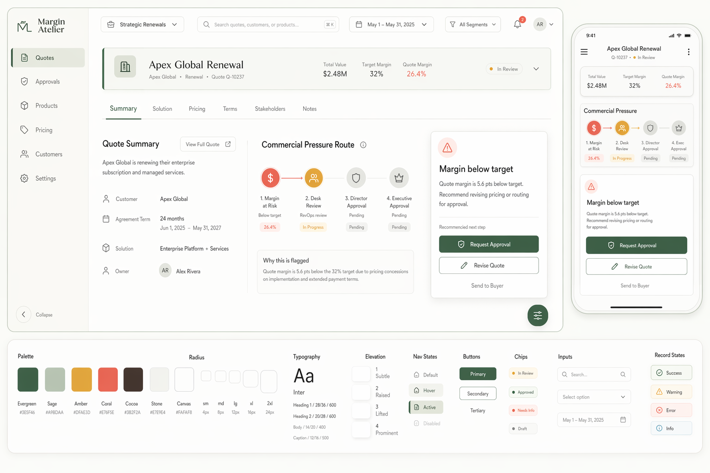
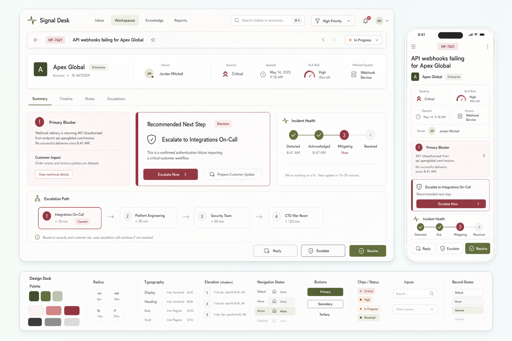
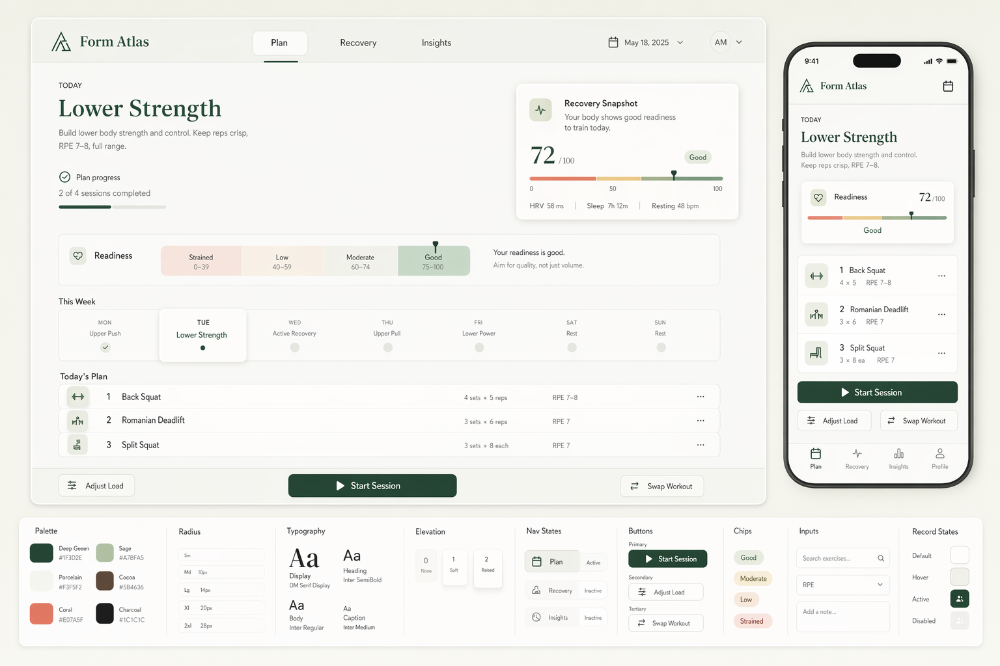

`Image design boards -> React + shadcn/ui`

# mock-to-ui

`mock-to-ui` is a skill for designing product UIs through GPT Image first and only then translating approved mocks into React + shadcn/ui. It is built for workflows where visual quality matters enough that a prompt-only code generation pass is not acceptable.

## What It Is

This skill makes the image mock the source of truth. It gathers an app brief, generates a light-mode design board, checks that board against a strict premium-quality gate, and only after approval moves toward implementation. The intended result is a frontend that feels designed, not like a generic starter dashboard.

## When To Use It

Use `mock-to-ui` when you want to:

- explore a new app, dashboard, workspace, or internal tool visually before coding
- generate premium mock boards for review without scaffolding the app yet
- turn an approved mock into a React + shadcn/ui implementation
- force a stricter anti-generic design standard than a default component-library layout
- validate that a design workflow generalizes across multiple app types

Do not use it when the job is only minor UI maintenance, simple content edits, or a fast implementation where no image-led design step is needed.

## Why Use It

Most UI generation workflows go straight from brief to code and land on familiar admin-template structure. This skill avoids that by forcing an explicit design phase first. It protects against default blue dashboards, dense widget walls, same-white surfaces, heavy shadows, generic sidebars, and other common fallback patterns.

The advantage is not just prettier mocks. The advantage is a better implementation contract: layout, density, hierarchy, color roles, radius, elevation, and responsive behavior are decided before code starts.

## How It Works

1. Gather the app brief and choose the visual direction.
2. Default to the repo's premium minimal style when the user does not specify a strict competing style.
3. Generate a light-mode design board first.
4. Require a board that includes desktop UI, mobile companion UI, and a compact design/token dock.
5. Compare the board against the written style rules and the mock-comparison checklist.
6. Reject weak mocks before they are shown or accepted.
7. After approval, generate the matching dark companion board if the workflow moves into implementation.
8. Translate the approved mock into React + shadcn/ui and verify visually with Playwright.

## Core Rules

- Light mode comes first unless the user explicitly wants dark-only output.
- Weak mocks are rejected automatically.
- Fresh prompts are used for validation batches instead of repeatedly patching one prompt.
- The workflow is app-first, not marketing-page-first.
- Mobile views must be calmer than desktop, not compressed copies.
- Implementation should not begin until the mock is approved, unless the user explicitly waives that step.

## Example Outputs

These are preserved mock boards from the current keeper set:

### CPQ

### Ticketing

### Health And Fitness

## What Makes This Skill Different

- It treats the image mock as the design source of truth.
- It uses strict written quality gates instead of accepting the first clean-looking output.
- It is tuned for premium minimal product UI, not generic SaaS templates.
- It supports both mock-only iteration and eventual implementation.
- It is built to test repeatability across multiple app categories, not just one lucky prompt.

## Repository Notes

- Main skill definition: `SKILL.md`
- Prompt templates: `assets/prompts/`
- Image generation script: `assets/scripts/generate-design-mock.mjs`
- Reference rules and comparison checklist: `references/`
- GitHub-facing showcase images: `showcase/`
